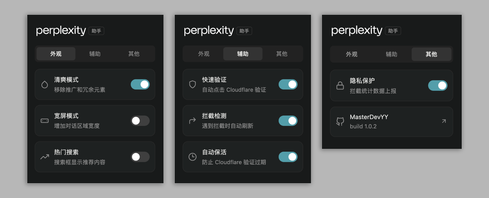
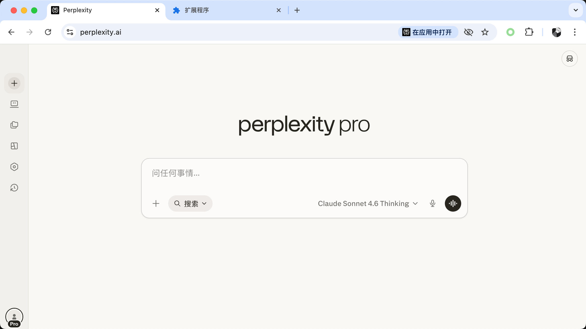

# Perplexity 助手

自动过验证、防掉线、去追踪、精简界面，还原纯净的 Perplexity 使用体验。

## 功能展示

## 使用效果

## ✨ 功能

- **快速验证** - 自动点击 CF 验证，无需手动操作
- **会话保活** - 定时发送保活请求，防止频繁验证
- **隐私保护** - 跳过强制手机号验证、第三方统计和追踪请求
- **界面优化** - 隐藏升级、推广、通知等干扰元素，支持宽屏模式

> 提示：通过模拟点击完成验证，遇到图形验证码仍需手动处理

## 📦 安装使用

1. 打开 Chrome 扩展管理页面 `chrome://extensions/`
2. 开启「开发者模式」
3. 点击「加载已解压的扩展程序」
4. 选择本项目文件夹

## 📝 更新日志

### 2026-05-19
- 修复样式

### 2026-05-11
- 新增跳过手机号验证、适配新版 UI

### 2026-03-17
- 隐藏首页 Computer 推广、问题推荐、快捷按钮

### 2026-03-13
- 跟进 UI 变化，优化清爽模式
- 隐藏推广横幅

### 2026-01-09

- 新增 `/rest/*` 接口 403 检测，自动刷新页面恢复会话
- 修复宽屏样式问题

### 2025-12-31

- 新增「降智检测」功能，检测模型是否被后台降级（
- 减少降级概率
- 优化清爽模式，隐藏更多干扰元素

### 2025-12-16

- 新增 404 页面自动跳转首页
- 优化 Cloudflare 验证框检测逻辑，兼容新版 Turnstile 结构
- 修复在登录页面误触发保活/跳转检测的问题

## 📄 许可

[GPL-3.0 License](LICENSE.md)